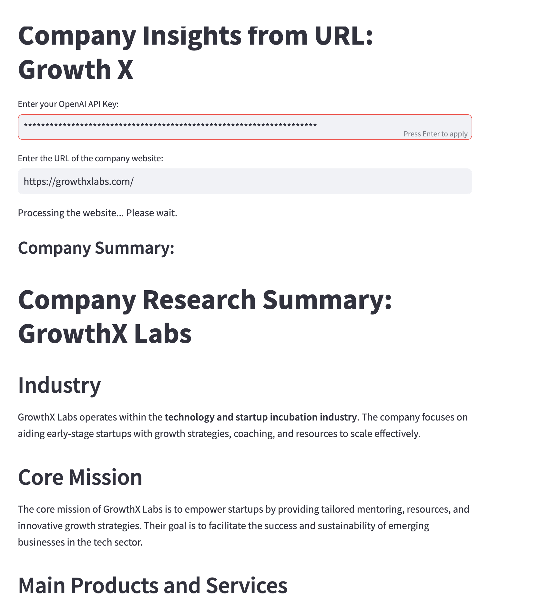

# AI-Automation-Task
This repository contains a reusable application that automatically scrapes company information and generates a concise, informative article about the prospect for the sales team, utilizing a large language model (LLM).


# Company Research AI: Automated Prospect Analysis Workflow

## Overview
This AI-powered tool assists sales teams by automating company research. Given a company's website URL, the application generates a concise report highlighting essential details for sales engagement. The tool scrapes the website's HTML content, processes it using OpenAI's API, and delivers an organized summary tailored to the needs of sales professionals. By automating research, the workflow reduces manual effort and improves prospect engagement.

- **Live App**: [AI Automation Task on Railway](https://ai-automation-task-production-a560.up.railway.app/)
- **Requirements**: `streamlit`, `selenium`, `chromedriver_autoinstaller`, and `openai`.

---

## Workflow Explanation

### 1. Web Interface and Input Collection (Streamlit)
   - The application uses `Streamlit` to provide an interactive interface where the user inputs an OpenAI API key and a company website URL.
   - When a valid API key is provided, and a URL is entered, the system initiates the research process.

### 2. Web Scraping with Selenium
   - The `Scraper` class, using Selenium, automates web scraping by loading the provided company URL and retrieving the HTML content.
   - **Headless Mode**: The scraping is set to run in headless mode, optimizing for speed and preventing the browser from opening visually.
   - **HTML Extraction**: The scraper waits for the webpage to load before capturing its HTML content, then closes the driver.

### 3. AI-Driven Analysis (OpenAI API)
   - The `LLM` class interacts with the OpenAI API to generate a report.
   - **Role and Style Prompting**: The system sends structured prompts to define the AI's role ("AI designed to produce research reports for sales teams") and output style, which organizes the data into categories such as industry, target audience, products, and recent news.
   - **Zero-shot Prompting**: This approach allows the AI to process data based solely on the prompt, without the need for examples or pre-training on similar tasks.

### 4. Report Generation and Display
   - After receiving the AI-generated report, the app displays it in a structured format on the Streamlit interface under the "Company Summary" section.
   - This final output enables the sales team to quickly understand key details about the prospect.

---

## Code Structure

### Key Components

- **`Scraper` Class**: Automates data extraction from the URL using Selenium.
- **`LLM` Class**: Interfaces with OpenAI's API to generate the sales-oriented summary based on HTML content.
- **Streamlit Interface**: Provides fields for user inputs (API key and URL) and displays the report.

---

## Reasoning for the Approach

The workflow leverages a combination of web scraping, AI-driven analysis, and structured prompts to create an efficient, automated company research tool for sales teams:

1. **Web Scraping**: The tool uses Selenium to retrieve HTML content from the company website, ensuring it gathers real-time data.
2. **Role and Style Prompting**: The OpenAI model is guided by prompts that focus on creating a sales report, delivering structured and concise output.
3. **Zero-shot Prompting**: The AI generates useful information based on the prompt without additional training data, simplifying setup and enhancing adaptability.
4. **Efficiency**: This system provides real-time summaries, streamlining the sales team's access to actionable insights.

---

## User Interface Screenshot



---

## Installation and Setup

1. **Clone the Repository**:
   ```bash
   git clone git@github.com:ctoanadu/AI-Automation-Task.git

## Example Usage

1. **Open the App**: Run the Streamlit app locally or visit the [live app link](https://ai-automation-task-production-a560.up.railway.app/).
2. **Enter API Key**: Input your OpenAI API key to authenticate the AI model.
3. **Input Company URL**: Enter the URL of the company website you wish to analyze.
4. **View Results**: After a brief processing period, view the AI-generated report summarizing key company insights for sales purposes.

